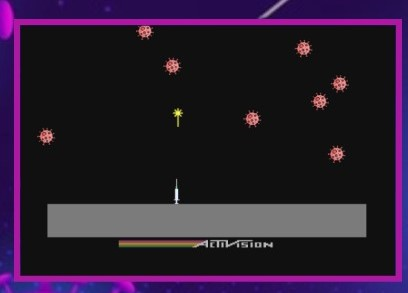

# MegaVacina

  
MegaVacina is my first project created with JavaScript, HTML and CSS. Its initial inspiration was the Atari MegaMania game, however, over the days I had to make some modifications resulting in a different but fun game!

## Installation

- Clone this project
- Open the index.html file in your browser

## About the game

Help the population to get rid of the pandemic! Vaccinate against all viruses before they get past you!

## How to play

- Press START button to begin
- Use "➡" to go right
- Use "⬅" to go left
- Use SPACEBAR to shoot
- Have fun saving the world by staying at home!

## Author

- Natália Alves
- [Linkedin](https://www.linkedin.com/in/nat%C3%A1lia-alves-5b00891b9/)
